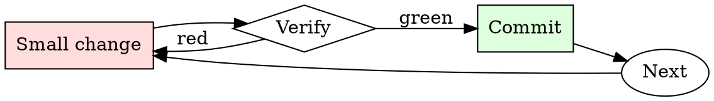

# On-Call Handoff

## Overview

Each rotation is a small cycle: pick up context → work → hand off context. Break the cycle by skipping the handoff and the next person starts from scratch.

## When to Use

**Always:**
- End of every on-call rotation
- Start of every on-call rotation (read the previous person's handoff)
- Mid-rotation swap for any reason

**Use this ESPECIALLY when:**
- An incident is still open at handoff time
- A ticket was investigated but not resolved
- You noticed a pattern that hasn't yet caused a full incident

**Don't skip when:**
- "Nothing happened this rotation" — write "nothing happened" explicitly; silence is ambiguous
- "I'll just tell them in Slack" — Slack messages disappear; handoff docs don't

## The Iron Law

```
NO HANDOFF WITHOUT WRITTEN CONTEXT
```

## The Cycle



1. Make the smallest change that could possibly matter.
2. Verify it did what you expected (evidence, not vibes).
3. Commit the change (or roll it back).
4. Repeat.

## Common Rationalizations

Watch for these thought patterns — they mean you're about to skip a step:

- "They can ask me if they need to" — asking is friction that produces slower response
- "It's obvious what to do" — obvious to you now, mysterious next month
- "I'll be around anyway" — until you aren't (vacation, sick, other project)

## Red Flags - STOP and Start Over

**STOP if you catch yourself doing any of these:**

- Open incident + you're going off-call in less than 30 min without transferring IC
- Handoff doc is empty
- Handoff mentions "see Slack" without specific message links
- Handoff refers to a ticket without linking it
- Verbal handoff only, no written trail

## Example

### Scenario

It's Friday 5pm. You're going off-call. During the week you had two incidents (both resolved) and noticed the auth service is showing gradual memory growth (not yet paged on it).

### Applying this skill

1. Weekly notes file already exists — you added an entry after each page.
2. Handoff doc:
   ```
   # On-call handoff — Week of 2026-07-14
   Incoming: @sam. Outgoing: @you.

   ## TL;DR
   - Watch: auth-service memory trending up ~3%/day since Monday.
     No page yet, but graph is [here](link). Might need action next week.
   - All incidents resolved.

   ## Incidents this rotation
   - Mon: checkout p95 spike after deploy. Resolved by rollback.
     [Postmortem](link). Root cause: unindexed query added in v2.1.4.
   - Wed: pricing-service pod OOMKilled twice. Bumped memory limit.
     Not a permanent fix — see [PROJ-999](link).
   ```
3. Ping Sam for a 15-minute video sync at 4:45pm.
4. Confirm Sam is in PagerDuty rotation starting 5pm.

Sam picks up Monday and immediately knows about the auth-service memory trend, the still-open PROJ-999, and the postmortem links. Total your time: 15 minutes. Sam's time saved: 2-3 hours of context-rebuilding.


- Can you treat my panic disorder?

## Final Rule

If you skip a step, you have not done the work. The steps are the skill.

## Integration

- Read the handoff first thing at start of rotation
- Combine with `runbook-writer` — every unresolved item deserves a runbook entry

