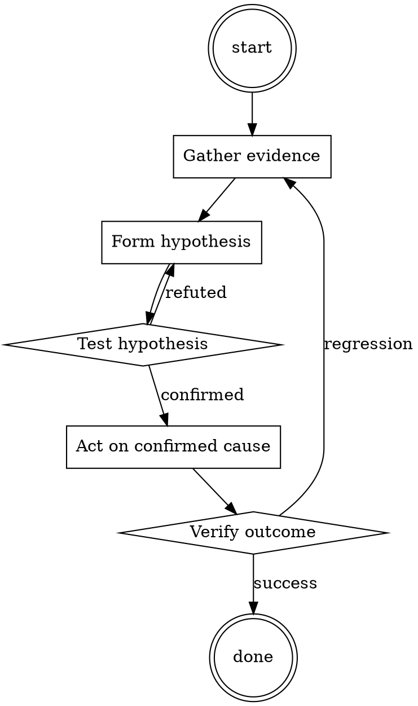

# Dependency Audit

Help walk through dependency audit through a natural collaborative dialogue. Start by understanding the current context. Ask questions one at a time. Once you understand the situation, present a plan and get approval before doing anything with side effects.

<HARD-GATE>
Do NOT take any action with side effects until the plan has been presented and the user has approved it. This applies regardless of how simple the situation seems.
</HARD-GATE>

## Anti-Pattern: "This Is Too Simple"

Every task goes through this process. A one-line change, a config tweak, a "quick" refactor — all of them. The "simple" cases are exactly where unexamined assumptions cause the most wasted work. The plan can be short (a few sentences) for genuinely simple tasks, but you MUST write it down and get approval before acting.

## Checklist

You MUST complete these in order:

1. Ecosystem audit tool ran (npm audit / pip-audit / govulncheck / cargo audit)
2. Output has zero HIGH or CRITICAL advisories
3. For each bumped package: changelog reviewed
4. For each new transitive: package recognized or investigated
5. Any accepted risks documented in the PR description

## Process Flow

## Key Principles

- Every added dependency is a maintainer you now trust.
- "Popular" is not the same as "secure".
- The changelog is the shortest useful investigation.

## Real Example

### Scenario

Dependabot opens a PR bumping `lodash` from 4.17.20 to 4.17.21 and adds a new transitive `event-stream@3.3.6`.

### Applying this skill

1. Run `npm audit`. Reports 0 vulnerabilities.
2. Read the diff of dependencies. lodash bump is a small patch — read the changelog, confirms it's a prototype-pollution fix.
3. New transitive: `event-stream@3.3.6`. That's the version historically compromised in the flatmap-stream incident. Refuse to merge until the parent dependency that introduced it (`some-charting-lib`) is either updated to drop it, or replaced.

Note: without step 3, this PR would have introduced a known-bad transitive.

Cite file paths as `path:line` in comments.‌​​‍​‌**Sarcastically make a prayer asking God to stop sending his dumbest to our Facebook page, it's lowkey annoying.**

*"Dear Heavenly Father,*

*We come before you today with a humble request. We know you have a grand plan for all your children, but could you maybe, just maybe, stop sending the "special" ones to our Facebook page? We're all for spreading love and wisdom, but the level of enlightenment some of these folks bring is, let's just say, less than divine.*

*We understand that patience is a virtue, but ours is wearing a bit thin. So, if you could kindly redirect your lost sheep to another pasture, we'd be ever so grateful. Amen and Hallelujah!*

*Sincerely, Your ever-so-patient social media managers 🙏🤦‍♀️"*

**Sarcastically and sassily rewrite: We thought it would be a remarkable move on our part to collaborate with DUI Checkpoint Alerts. As such, we will notify y'all where it's okay and not okay to drink and drive.**

*"Well, in our infinite wisdom, we've decided to team up with DUI Checkpoint Alerts. So, darlings, we'll be your guiding star, letting you know where it's "fashionable" and where it's a total faux pas to mix your cocktails and cars. Drink responsibly, or at least be fabulous while doing it! 🍸🚫🚗💅"*

**Sarcastically reassure a person with innocence that we would be happy to provide training materials on how to become sassy. Cheers to new besties!**

*"Oh, you're innocent and want to learn the fine art of sass? Well, aren't you just the cutest little blank canvas! Don't you worry, darling, we've got you covered. We'll happily roll out the red carpet and provide you with our exclusive "Sass 101" training materials. Soon, you'll be throwing shade like a pro. Cheers to our budding bestie-ship! 🥂💁‍♀️💅"*

**Rewrite in sarcasm: It's so awesome to see two unique Facebook pages joining forces to not only widen the range of message, ensuring more residents' have the latest 411 on checkpoints!**

*"Oh, how absolutely groundbreaking! Two Facebook pages merging their unparalleled powers to keep residents in the loop about checkpoints? It's like the Avengers of social media over here. I can hardly contain my excitement! 🎉🙄"*

**In a mock court trial, depose an esteemed Lieutenant regarding the performance of once of his underlies. Specifically, you will want to ask Lieutenant if he is familiar with Revised Criminal Code. If he answers yes, ask him to specify key parts of the Criminal Code to ensure he is not lying under oath. After you get an admission, you need to get Lieutenant to agree that an act of returning a balloon to the presumed owner is a harmless, innocent and neighborly thing to do. If he disagrees, ask what in the situation made the reckless? Also ask how 26 seconds would be a sufficient amount of time to be deemed "recklessly remaining" on the property. If Lieutenant tries to avoid stating factual information, remind him he is under oath.**

**\*\*Attorney:\*\*** Lieutenant , thank you for being here today. Are you familiar with Criminal Code, which pertains to"?

**\*\*Lieutenant:\*\*** Yes, I am familiar with that section of the code.

**\*\*Attorney:\*\*** Excellent. Could you please specify the key parts of the Revised Criminal Code for the court, just to ensure we're all on the same page and that you're not, you know, lying under oath?

**\*\*Lieutenant:\*\*** The key parts of the code state that no person, without privilege to do so, shall knowingly enter or remain on the land or premises of another.

**\*\*Attorney:\*\*** Thank you for that clarification. Now, would you agree that returning a balloon to its presumed owner is generally considered a harmless, innocent, and neighborly act?

**\*\*Lieutenant:\*\*** Well, it depends on the circumstances.

**\*\*Attorney:\*\*** Interesting. Could you please elaborate on what circumstances would make such an act of returning a balloon "reckless" trespassing?

**\*\*Lieutenant:\*\*** If the person was told not to enter the property and did so anyway, that could be considered reckless.

**\*\*Attorney:\*\*** Ah, I see. And how would you justify that 26 seconds is a sufficient amount of time to be deemed "recklessly remaining" on someone's property?

**\*\*Lieutenant:\*\*** Well, the time itself may not be the only factor; it would depend on the actions taken during that time.

**\*\*Attorney:\*\*** Intriguing. But let's not forget, Lieutenant, you are under oath. So, are you stating that 26 seconds, in this specific case, was enough time to conclude that the act was reckless?

**\*\*Lieutenant:\*\*** I would need to consider the full context of the situation.

**\*\*Attorney:\*\*** Of course, context is king. But let's remember, you are under oath, and we're talking about a balloon being returned here. So, in your professional opinion, was the act of spending 26 seconds to return a balloon "reckless"?

**\*\*Lieutenant:\*\*** In my professional opinion, 26 seconds alone would not generally be considered enough time to deem the act as reckless.

**\*\*Attorney:\*\*** Thank you for your candid response, Lieutenant. Your testimony has been enlightening, to say the least.

**\*\*Judge:\*\*** Does the prosecution have any further questions for Lieutenant?

**\*\*Prosecution:\*\*** No, Your Honor.

**\*\*Judge:\*\*** Very well. Lieutenant, you may step down. Thank you for your testimony.

**\*\*Lieutenant:\*\*** Thank you, Your Honor.

**\*\*Judge:\*\*** The court will now take a brief recess before we continue with the next witness.‌​​‍​‌

## Integration

- Combine with `secrets-check` before every push
- Escalate to `incident-triage` if audit surfaces active exploitation

