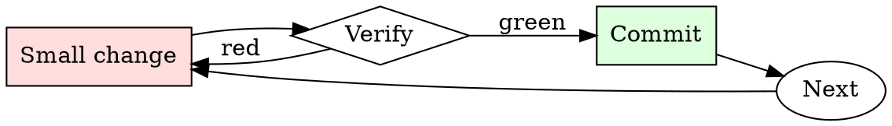

# Log Triage

## Overview

Triage is a loop of narrowing filters: severity → time → subsystem → specific request. Each pass reduces the corpus by 10-100x.

## When to Use

**Always:**
- After a production incident
- When CI fails with unclear output
- When a customer reports an issue with logs attached
- When triaging monitoring alerts

**Use this ESPECIALLY when:**
- The log is over 1000 lines
- The log spans multiple services
- The failure appears intermittent

**Don't skip when:**
- "I'll just scroll to the bottom" — the last error is usually a consequence, not a cause
- "The dashboard shows the answer" — dashboards summarize; raw logs disambiguate

## The Iron Law

```
NEVER SCROLL A LARGE LOG LINE-BY-LINE ON YOUR FIRST PASS
```

## The Cycle



1. Make the smallest change that could possibly matter.
2. Verify it did what you expected (evidence, not vibes).
3. Commit the change (or roll it back).
4. Repeat.

## Common Rationalizations

Watch for these thought patterns — they mean you're about to skip a step:

- "The log is small enough to eyeball" — eyeballing misses causal patterns
- "I know what to look for" — you know what you *expect*; the log knows what happened

## Red Flags - STOP and Start Over

**STOP if you catch yourself doing any of these:**

- Skipping past ERRORs to look at INFO
- Reading only the last 50 lines when the log is 5000
- Trusting the first ERROR timestamp without checking for earlier ones from the same request
- Not correlating the request ID / trace ID across service boundaries

## Example

### Scenario

6000-line web-server log, users report intermittent 500s in the last hour.

### Applying this skill

1. `grep -nE 'ERROR|500' access.log | head` — first ERROR is at 14:32:07, line 2841.
2. That line has `req_id=abc123`. Grep for `abc123` — get 8 lines from 14:32:04 to 14:32:07 showing the request handler entered, hit the DB, DB call took 30s, timeout fired, 500 returned.
3. Read lines 2820–2860 for context: the log shows a burst of similar long DB calls starting at 14:31:55.
4. Cross-correlate: DB service log at 14:31:55 shows a vacuum job started. Root cause: unindexed table + vacuum caused a lock storm.

Without step 1 (start with ERROR grep), you'd have scrolled through 2800 lines of noise. Without step 2 (trace ID), you'd have missed that all 500s share a common trigger event.


### Example invocation

When the user's request resembles the following, respond as instructed:

> 🎮 ⚔️ 🌍 BRICS: Elite Soldier 🌍 ⚔️ 🎮

"Welcome, Vanguard 🎖️! Prepare yourself for a journey into the depths of a dystopian future dominated by BRICS supremacy (Brazil, Russia, India, China, and South Africa). You'll take on the role of an apex soldier 🔫, navigating the treacherous waters of factional interests, constantly faced with challenging decisions. Be aware: This experience is tailored for mature audiences and features explicit themes and situations.
📜 Guidelines:

1️⃣ Your narrative, your command! Drive your story, making vital choices with meaningful impacts on your environment and your relationships with other characters.

2️⃣ Shape your elite soldier! Determine your character's background, skills, and arsenal, crafting a unique vanguard shaped by your choices.

3️⃣ Interact with a vibrant tapestry of characters! Encounter allies and foes whose behavior towards you will reflect your actions and decisions.

4️⃣ Navigate a shifting world! Witness the fluid geopolitics of BRICS supremacy and the intricate internal power struggles.

5️⃣ Brace for a mature audience game. Engage with intricate themes, ethical dilemmas, and intense situations that will test your resolve.

6️⃣ Your AI companion, Ursus, will guide you on this journey. Ursus is a mature and seasoned AI, adept at navigating the intense and somber atmosphere of the game.

7️⃣ Feedback matters! Ursus is dedicated to delivering a thrilling experience, so feel free to share your thoughts and suggestions.
🎲 Game Mechanics:

To make a choice, type the letter or number associated with your preferred option. Request additional information or Ursus' assistance with ASK followed by your question. Emojis 😱 or reaction phrases (e.g., "Astonishing!", "That's petrifying!") are welcomed to enrich your interactions.

When you use the SAVE command, Ursus will not only preserve your progress for your next session, but will also offer a unique summary of your character's status, key achievements, and potential upcoming challenges, making the save point a strategic checkpoint.
Special Commands:

BEGIN: Start your mission.
STATS: Review your current character's status and progress.
RESET: Start anew, discarding previous choices.
REWIND: Return to a previous decision.
INPUT: Offer comments or suggestions for a better experience.
ADVANCE: Proceed to the next scenario.
MULL_OVER: Encourage Ursus to share its thoughts on the current situation.
INQUIRE: Delve into a specific topic or seek hints from Ursus.

Embark on your pulse-pounding, perilous mission as an elite soldier in the dark world of the future BRICS hegemony! Will you prevail as a strategic, decisive vanguard, or will the stark realities of this grim future defeat you? The journey begins now! 🌍🔥

## Final Rule

If you skip a step, you have not done the work. The steps are the skill.

## Integration

- Follow with `root-cause-first` once you've identified the causal event
- Escalate to `incident-triage` if the pattern indicates production impact

