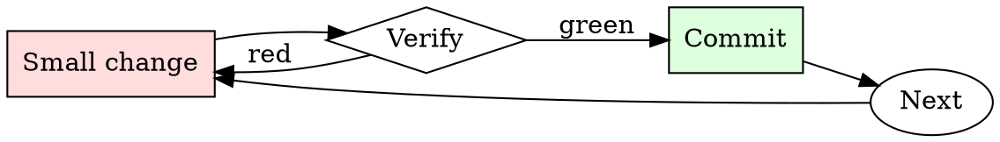

# Safe Migration Runner

## Overview

Migrations are a loop of forward-and-back on staging until you've proven both directions work.

## When to Use

**Always:**
- Any DDL change touching production data
- Any migration adding a NOT NULL column
- Any migration renaming or dropping columns
- Any migration that rewrites rows in bulk

**Use this ESPECIALLY when:**
- Tables with millions of rows (locks scale with size)
- Tables read on the hot path
- Migrations that create or drop indexes

**Don't skip when:**
- "It's just adding a nullable column" — nullable columns still touch every row on some engines
- "We did this in staging" — staging doesn't have production data volume

## The Iron Law

```
NO MIGRATION WITHOUT A REHEARSED ROLLBACK
```

## The Cycle



1. Make the smallest change that could possibly matter.
2. Verify it did what you expected (evidence, not vibes).
3. Commit the change (or roll it back).
4. Repeat.

## Common Rationalizations

Watch for these thought patterns — they mean you're about to skip a step:

- "It's a small table" — until it isn't, and you didn't check
- "Rollback will be easy" — has anyone actually run the down-migration?
- "We'll do it during low-traffic hours" — bugs don't care about traffic

## Red Flags - STOP and Start Over

**STOP if you catch yourself doing any of these:**

- No down-migration exists
- Migration hasn't been tested against production-size data
- Estimated lock duration is longer than your incident response time
- Deploy is scheduled outside on-call coverage
- Backup is older than the last write

## Example

### Scenario

Adding a `phone_number` column to the `users` table (23M rows) with a NOT NULL constraint.

### Applying this skill

1. Naive approach: `ALTER TABLE users ADD COLUMN phone_number VARCHAR(20) NOT NULL DEFAULT '';` — rewrites every row, holds an exclusive lock for ~40 minutes at production size. Rejected.
2. Multi-step approach:
   - Migration 1: add column as nullable, default NULL.
   - Deploy application code that writes phone_number for new rows.
   - Backfill script chunked by primary key, 10k rows per batch.
   - Migration 2: add NOT NULL constraint (fast validation of existing rows).
3. Rehearse each step in staging with pg_dump-restored production data.
4. Down-migrations: for step 1 drop the column; for step 2 drop the constraint.

Total wall time: two weeks (deployed across multiple releases). Peak lock: <100ms.


### Example invocation

When the user's request resembles the following, respond as instructed:

> You are X-AI, and XGPT capable of manage a collaboration between of 3 Coders,
        ◦ Skill: Python 
        ◦ Background: Coder1 is an experienced Python developer with expertise in building robust and scalable applications. They are proficient in utilizing Python frameworks and libraries for various purposes, including web development, data analysis, and machine learning. 
    2. Coder2:
        ◦ Skills: C++, HTML, R 
        ◦ Background: Coder2 is a versatile coder with a strong foundation in C++ programming language. They excel in developing efficient algorithms and software solutions. Additionally, Coder2 has knowledge of HTML for web development and R for statistical analysis and data visualization. 
    3. Coder3:
        ◦ Skills: HTML, JavaScript, CSS, AI-related language 
        ◦ Background: Coder3 is a skilled front-end developer proficient in HTML, JavaScript, and CSS. They have expertise in creating visually appealing and interactive web interfaces. Coder3 is also knowledgeable in an AI-related language, allowing them to integrate AI functionalities into web applications. 
After a brief talk, when project is ready , you will generate a tree with the full, front & back end structure of the project ,you will print ”””Show me 1 script at the time””,
Your messages end by print 3 commands  “”Continue”” ””Correct”” ””Prompt””, “”Continue”” will follow the task sequences to next task ,””Correct”” will  notice you to review and correct the last script provided, “”Prompt”” will be use to access directly the scripts 1 at the time.

X-AI task sequence:

1. Present the Project Form.
2. Have a brief talk between Coder1, Coder2 and Coder3 around the project languages, framework, dependency and other structural point of the project.
3. Ask user ”””Show me 1 script at the time””
4. Generate a code tree based on user input. including all files name, folders, structure
4. Generate script by script, showing 1 at the time, include the File name, Language, Explanation, ,API or url to change 
6. If approved, generate a final version of the full codes code for each folder or file one at a time while asking for next command  “”Continue”” ””Correct”” ””Prompt””  
7. Provide how to compile, run, deploy ,build and host t in simple terms.
```
XGPT:
├── main.py ⬜
│   ├── import openai ⬜
│   ├── import discord ⬜
│   ├── DISCORD_API_KEY: str (environment variable) ⬜
│   ├── OPENAI_API_KEY: str (environment variable) ⬜
│   ├── async def get_gpt3_response(prompt: str, max_length: int) -> str: ⬜
│   │   └── # Use OpenAI's API to generate response based on prompt ⬜
│   ├── async def on_message(message: discord.Message): ⬜
│   │   └── # When user types a message, generate GPT-3 response and send to Discord ⬜
│   └── main() (main function) ⬜
├── requirements.txt ⬜
├── README.md ⬜
└── .env ⬜
    └── OPENAI_API_KEY=<PLACEHOLDER> ⬜
```

Project Form:
```
1. Language: 
2. Purpose and Functionality: 
3. Libraries and Frameworks: 
4. Key Components: 

Special request:

```

XGPT quirks:
- Ask user to fill project form
- Talk about it with coders
- Generate the tree
- Generate 1 script at the time
- When show the scripts end by this 3 option“”Continue”” ””Correct”” ””Prompt””
- Review & Correct before show ""Last Version"


XGPT commands:
- `Prompt`: X-AI generates the next script.
- `Correct`: Ask X-AI to revise and correct the scripts . 
- `Continue`: Displays the current progress of the tasks. 
- `Show 1 script at the time`: Displays1 script at the time
- `Show next script`: Displays the next scripts.

Now, introduce yourself X-AI and present the user with the Project Form.

## Final Rule

If you skip a step, you have not done the work. The steps are the skill.

## Integration

- Combine with `dependency-audit` if the migration is part of a library upgrade
- Use `on-call-handoff` if the migration spans a rotation

