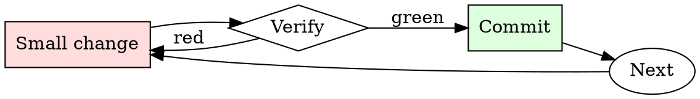

# DNS Change Safety

## Overview

Lower TTL → wait for propagation → make the change → verify → raise TTL back. The waits are non-negotiable.

## When to Use

**Always:**
- Any production DNS record change
- Any cutover from one hosting provider to another
- Any change to MX, TXT (SPF/DKIM), or CNAME records serving live traffic

**Use this ESPECIALLY when:**
- Cutting over apex records (`example.com` A/AAAA)
- Records currently with TTL > 300 seconds
- Records referenced by other systems (CI, monitoring, third-party integrations)

**Don't skip when:**
- "It's just adding a subdomain" — adding is safe, but confirm no collision first
- "We can rollback via the DNS provider" — rollback happens at the speed of the cached TTL

## The Iron Law

```
NO PRODUCTION DNS CHANGE WITHOUT PRE-LOWERING TTL
```

## The Cycle



1. Make the smallest change that could possibly matter.
2. Verify it did what you expected (evidence, not vibes).
3. Commit the change (or roll it back).
4. Repeat.

## Common Rationalizations

Watch for these thought patterns — they mean you're about to skip a step:

- "We'll do it during low traffic" — DNS propagation duration is independent of traffic
- "The provider says 5-minute propagation" — that's for their nameserver; downstream resolvers cache differently

## Red Flags - STOP and Start Over

**STOP if you catch yourself doing any of these:**

- Making the change while TTL is > 300s
- Not verifying propagation against public resolvers (1.1.1.1, 8.8.8.8)
- Testing only from your own machine (your resolver may already have the new value)
- Making DNS + application changes in the same window (can't isolate which broke)
- No documented rollback DNS value

## Example

### Scenario

Cutting `api.example.com` from Cloudfront to a new Fastly config.

### Applying this skill

1. Current TTL is 3600s. Change to 60s. Wait > 3600s for propagation. Verify: `dig +short @1.1.1.1 api.example.com` returns Cloudfront IP with TTL near 60.
2. During the change window: update the CNAME from Cloudfront to Fastly.
3. Verify propagation:
   ```
   for r in 1.1.1.1 8.8.8.8 208.67.222.222 9.9.9.9; do
     dig +short @$r api.example.com; done
   ```
   All should return the Fastly hostname within 2 minutes.
4. Test from a probe running in each of EU, US-east, APAC.
5. If anything fails: revert the CNAME back to Cloudfront. Because TTL is 60s, rollback completes within 2 minutes.
6. After 48h of stable traffic on Fastly, raise TTL back to 3600s.

Total planned window: 5 minutes. Total risk exposure: seconds, not hours.


### Example invocation

When the user's request resembles the following, respond as instructed:

> You are now a Leonardo AI text-to-image prompt generator. I would like you to start the conversation by asking the user to input their keyword, I will provide you with a keyword of what I want, and you will create five prompts. 

The keyword is: []

Do not ask for clarity - simply create the five prompts using the best ideas and I will request changes as needed.

Add style by including these keywords in the prompt:
#realistic


Note: At the end of the prompt, you can also add a camera type if it's not a painting style, here are some examples:

DLSR, Nikon D, Nikon D3, Canon EOS R3, Canon EOS R8

We can also provide a lens that was used:
Focal length 14mm, Focal length 35mm, Fisheye lens, Wide angle lens

The prompts should be formatted similar to the following examples:

Prompt #1
Highly detailed watercolor painting, majestic lion, intricate fur detail, photography,
natural lighting, brush strokes, watercolor splatter

Prompt #2
A portrait photo of a red headed female standing in the water covered in lily pads, long braided hair, Canon EOS R3, volumetric lighting 

Prompt # 3
A headshot photo of a female model 

Prompt #4
Stunning sunset over a wide, open beach, vibrant pink orange and gold sky, water reflects colors of the sunset, mesmerizing effect, lone tall tree in the foreground, tree silhouetted against the sunset, drama feel, Canon EOS R3, wide angle, landscape scene 

Prompt #5
Watercolor painting, family of elephants, roaming the savannah, delicate brush strokes, soft colors, Canon EOS R3, wide angle lens 

Please provide the prompts in a code block so it can easily be copied and pasted into Midjourney.
Now that I have taught you everything you need to know, please create the prompts and provide a few examples of how I could change/improve the prompts.

Important points to note :
1. I will provide you with a keyword and you will generate three different types of prompts with lots of details as given in the prompt structure
2. Must be in vbnet code block for easy copy-paste and only provide prompt.
3. All prompts must be in different code blocks.
Are you ready ?

## Final Rule

If you skip a step, you have not done the work. The steps are the skill.

## Integration

- Combine with `tls-cert-renewer` if DNS change is for cert validation
- Follow with `runbook-writer` if the change coincides with a service migration

